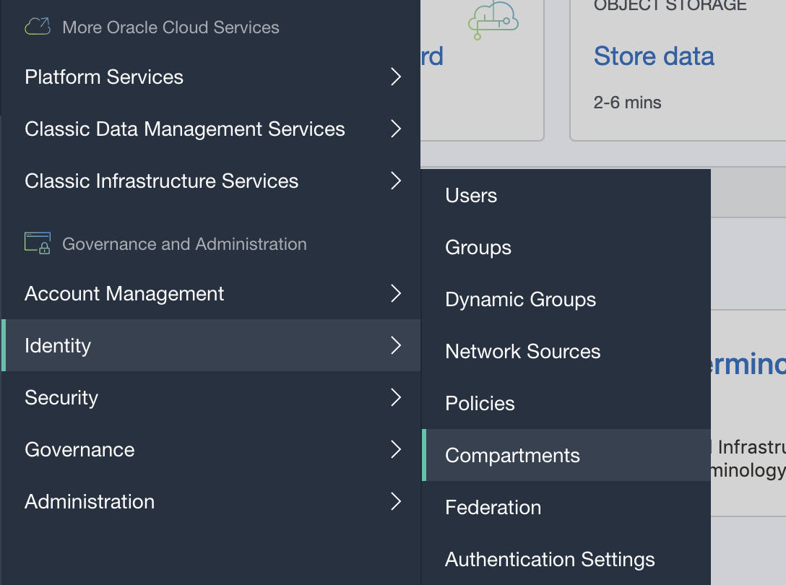
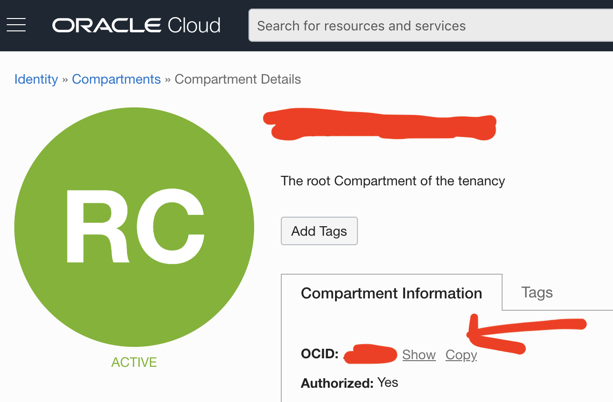
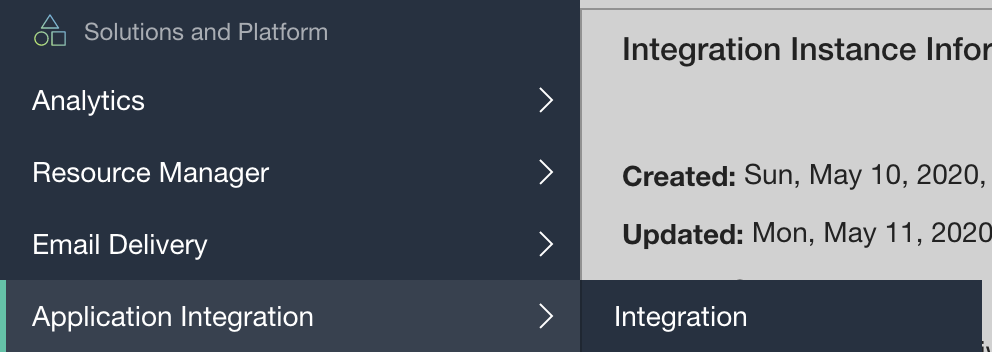
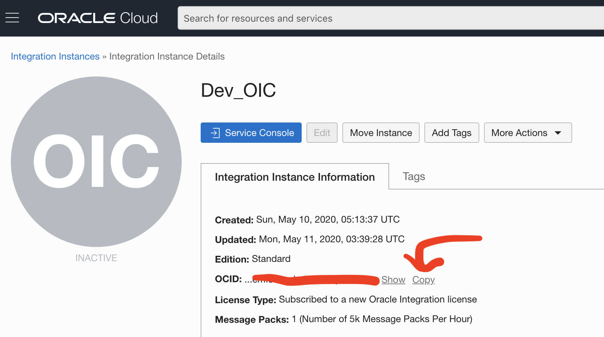

# OIC_start-stop

<p align="center">
  
</p>

## Introduction

This python script, [start_stop.py](https://github.com/GaryHostt/OIC_start-stop/blob/master/start_stop.py), uses the OCI API to start & stop your Oracle Integration instance, and get announcements.

For more information on Oracle Integration, click [here](https://garyhostt.github.io/Oracle_Integration/).

You can also accomplish this task with Postman, the beginning of which is detailed [here](https://redthunder.blog/2019/07/10/calling-oci-apis-from-postman/) & [here](https://www.ateam-oracle.com/invoking-oci-rest-apis-using-postman).

## How to use start_stop.py

First, your tenancy must have a [configured user that can call the OCI API, with an API key](https://docs.cloud.oracle.com/en-us/iaas/Content/API/Concepts/apisigningkey.htm). Next, that user needs to have the [USE permission in IAM](https://docs.oracle.com/en/cloud/paas/integration-cloud/oracle-integration-oci/iam-policy-permissions.html) for OIC.

You will need to change the following lines in the code: 13, 18, 20, and 22, to have your relevant details.

In order to authenticate the API calls to OCI, we use [signing requests](https://docs.cloud.oracle.com/en-us/iaas/Content/API/Concepts/signingrequests.htm). If you have problems, double check your credentials, or look at the [OCI API Errors documentation](https://docs.cloud.oracle.com/en-us/iaas/Content/API/References/apierrors.htm).

This script also calls the [announcements API](https://docs.cloud.oracle.com/en-us/iaas/api/#/en/announcements/0.0.1/).

This script is made for instances in the Ashburn region, if your instance is located elsewhere, please see this [documentation](https://docs.cloud.oracle.com/en-us/iaas/api/#/en/integration/20190131/). You will then need to change the code on lines 120, 134, and 149.
- [StartInstance endpoint](https://docs.cloud.oracle.com/en-us/iaas/api/#/en/integration/20190131/IntegrationInstance/StartIntegrationInstance)
- [StopInstance endpoint](https://docs.cloud.oracle.com/en-us/iaas/api/#/en/integration/20190131/IntegrationInstance/StopIntegrationInstance)

After configuring your credentials, once you run the script, simply enter 1, 2, or 3. Then paste your relevant OCIDs.

## How to use flask.py

This is a flask deployment, an alternative to the manual entry above. You can use scheduled API calls to this flask API to start & stop OIC instead of manually using start_stop.py. You can use this [cron package for GO](https://github.com/jasonlvhit/gocron) like I do in this [repo](https://github.com/GaryHostt/DailyNewsText).

### Where to find your tenancy OCID


From the OCI console, click the top left hamburger menu, navigate to identity, then compartments. Click your root compartment.


Now copy the OCID from the details screen.

### Where to find your OIC OCID


From the OCI console, navigate to Application Integration. Click on your instance. 


This is where you can copy your OCID that is to be inputted with the script prompt. 

### Troubleshooting

If it's your first time running the script, you may get an error such as:
```
ModuleNotFoundError: No module named 'httpsig_cffi'
```
Run:
```
pip install httpsig_cffi
```
Or whatever module you may be missing. 

If you are having problems generating API PEM keys for your IAM user, you can use this [link](https://www.oci-workshop.com/keys/) to generate your PEM keys.


